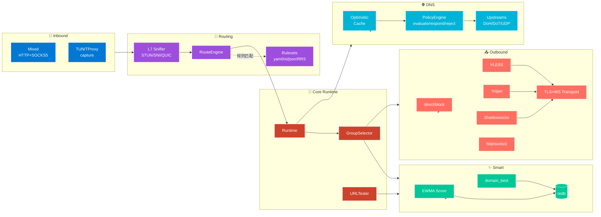
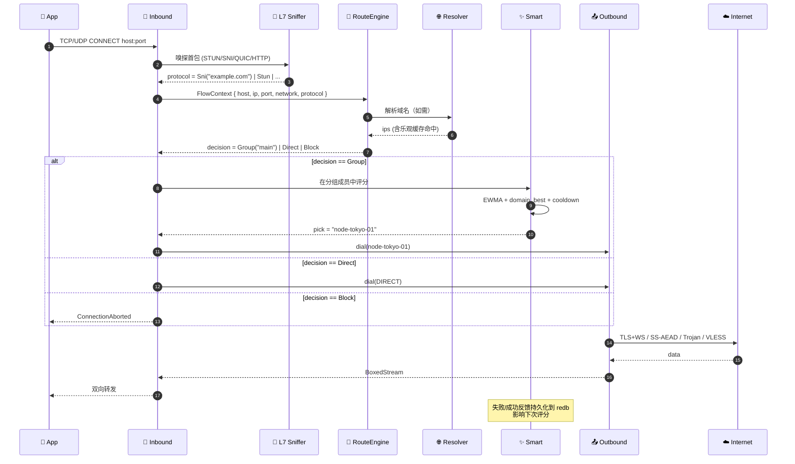
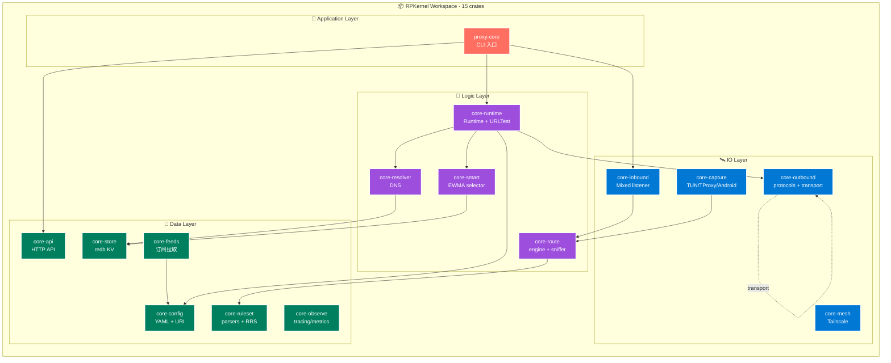
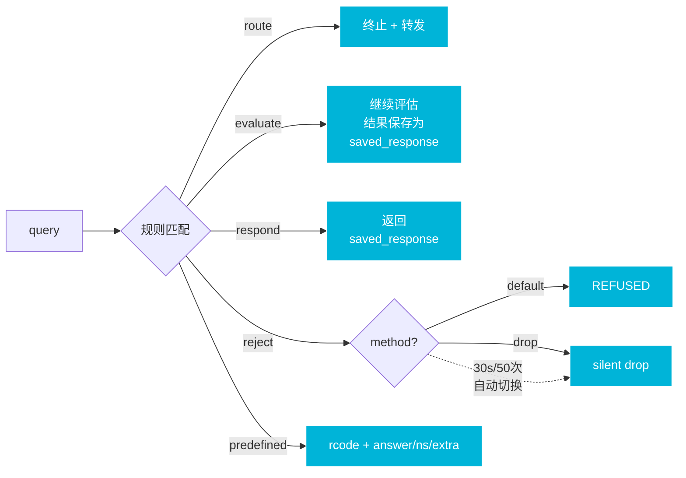
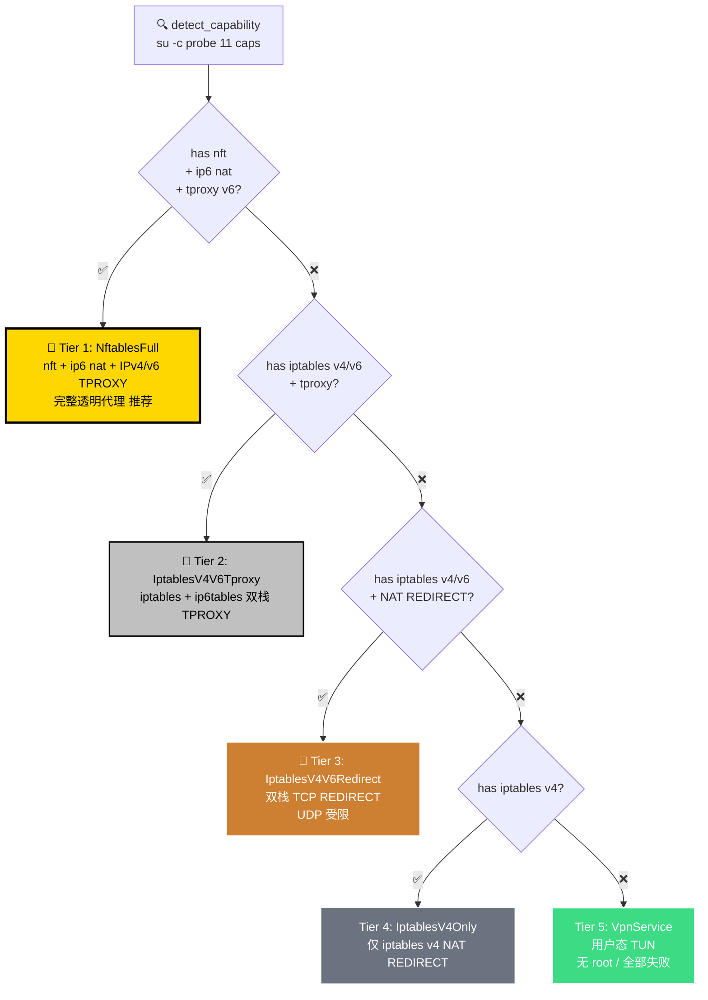

<div align="center">

# 🌊 WutherCore

**下一代 Rust 代理内核 · 兼容 mihomo / sing-box · Friendly YAML 配置**

*小白能看懂 · 专家能扩展 · 字段独立但能力对齐*

---

<!-- 第一行：核心徽章 -->

[](https://www.rust-lang.org/)
[](https://doc.rust-lang.org/edition-guide/)
[](LICENSE)
[]()
[]()

<!-- 第二行：能力徽章 -->


<!-- 第三行：协议徽章 -->


-✓-brightgreen?style=flat)


<!-- 第四行：平台徽章 -->

[]()
[]()
[]()
[]()
[]()
[]()

<!-- 第五行：构建工具链徽章 -->

[]()
[]()
[]()
[]()
[]()

<!-- 项目活力徽章（占位，仓库为 private 不直连 shields.io） -->


</div>

---

## 📑 目录

<div align="center">

| [🎯 核心特性](#-核心特性) | [⚡ 快速开始](#-快速开始) | [🏗 架构总览](#-架构总览) | [🌐 数据流](#-数据流) |
|:---:|:---:|:---:|:---:|
| [🧩 工作空间](#-工作空间布局) | [📊 功能矩阵](#-功能矩阵) | [🔌 协议支持](#-协议支持) | [🌍 DNS 系统](#-dns-系统) |
| [📂 规则集系统](#-规则集系统) | [📱 Android 5-Tier](#-android-root-模式) | [🚀 性能与构建](#-性能与构建) | [🛰 API 接口](#-api) |
| [🧪 测试覆盖](#-测试覆盖) | [🗺 路线图](#-路线图) | [📜 许可证](#-许可证) | [🎨 配色](#-视觉规范) |

</div>

---

## 🎯 核心特性

<table>
<tr>
<td width="33%" valign="top">

### 🧠 智能选节点
- **EWMA** 成功率衰减
- **URLTest** 周期测速
- `domain_best` 缓存 + 冷却
- 全部 **redb** 持久化
- 支持 `pin/avoid/reset/why`

</td>
<td width="33%" valign="top">

### 🌐 强大 DNS
- 乐观缓存 + LRU
- **多 group 并发** (fastest/fallback/all)
- sing-box 1.14 完整动作
- 三层 ECS fallback
- redb 持久化跨重启

</td>
<td width="33%" valign="top">

### 🛡 防 IP 泄漏
- **L7 嗅探** STUN/DTLS/QUIC/SNI/HTTP
- WebRTC 流量按规则路由
- Fake-IP 双栈 (v4 + v6)
- DNS 劫持 + Tailscale 防回环

</td>
</tr>
<tr>
<td valign="top">

### 📦 规则集生态
- mihomo: yaml/txt/list ✅
- sing-box: JSON ✅
- **自研 RRS**: 二进制 + CRC32
- 双向无损转换
- ~45% 体积压缩

</td>
<td valign="top">

### 📱 Android Root
- **5 Tier 自动降级**
- 11 项能力探测
- nft → iptables → VPN
- IPv4/IPv6 双栈 NAT/TPROXY
- root 失败优雅降级

</td>
<td valign="top">

### ⚙️ 工程质量
- **15 crates** 高内聚
- 全测试 119/0 通过
- `forbid(unsafe_code)`
- rust-lld/mold 链接
- 增量编译 22s → 2s

</td>
</tr>
</table>

---

## ⚡ 快速开始

### 🪄 最小有效配置（10 个词，4 行 YAML）

```yaml
version: 1
profile: desktop
feeds:
  my_airport: "https://example.com/your-subscription"
```

> **就这么多。** 内核自动补：本地代理 7890、面板 9090、main 分组 Smart、国内直连、国外走 main、DoH/DoT smart 解析。

### 🛠 一键多平台构建（Windows 主机）

```cmd
build.cmd                  :: 默认矩阵：Win MSVC + Linux musl/gnu + Android arm64
build.cmd windows          :: 单目标
build.cmd linux            :: zigbuild 后端
build.cmd android          :: cargo-ndk 后端（NDK 自动发现）

pwsh -File scripts/build-all.ps1 -Backend zigbuild -Targets "x86_64-unknown-linux-musl"
```

### 🚀 直接 cargo

```bash
cargo build --release -p proxy-core
./target/release/proxy-core check    examples/desktop.yaml
./target/release/proxy-core explain  examples/desktop.yaml
./target/release/proxy-core run -c   examples/desktop.yaml
```

### 🧰 CLI 子命令一览

```text
proxy-core run        -c <yaml>             启动内核
proxy-core check         <yaml>             校验配置
proxy-core explain       <yaml>             输出 RuntimePlan JSON
proxy-core migrate mihomo <old.yaml> -o <friendly.yaml>
proxy-core feeds   list/refresh             订阅源管理
proxy-core ruleset list/refresh/convert     规则集管理（含 yaml↔txt↔json↔rrs）
proxy-core store   info/reset               持久化数据管理
```

---

## 🏗 架构总览



---

## 🌐 数据流

> **一次连接的生命周期** —— 从入站到拨号的完整路径。



---

## 🧩 工作空间布局



---

## 📊 功能矩阵

<div align="center">

| 模块 | 关键能力 | 测试 | 状态 |
|---|---|:---:|:---:|
| 🎛 **Config** | profile 默认值、节点 URI 解析（ss/vless/vmess/trojan/...）、route preset/sets/steps、payload 内联 |  | ✅ |
| ⚙️ **Runtime** | Runtime + GroupSelector(manual/smart/fast/stable/spread/chain) + URLTest 周期测速 |  | ✅ |
| 🔌 **Inbound** | Mixed HTTP+SOCKS5 同端口 + 跨平台权限检测 + 端口降级 + Android su 提权 |  | ✅ |
| 📤 **Outbound** | direct/block/http/socks5/SS-AEAD/Trojan/VLESS + TLS+WS 传输层 |  | ✅ |
| 🚦 **Route** | preset 编译 + 规则引擎 + L7 嗅探（STUN/DTLS/QUIC/SNI/HTTP）+ proto:webrtc 别名 |  | ✅ |
| 🌐 **Resolver** | 乐观缓存 + LRU + Group 三策略 + sing-box 完整动作 + ECS 三层 + redb 持久化 |  | ✅ |
| 📂 **Ruleset** | yaml/txt/list/json 解析 + RRS encode/decode + double-pass 一致性 + 6 种 matcher |  | ✅ |
| 📡 **Feeds** | Base64/Clash/SIP008/Plain 解析 + 过滤重命名 + 缓存回退 |  | ✅ |
| ✨ **Smart** | EWMA + cooldown + 跨重启持久化 |  | ✅ |
| 💾 **Store** | redb 单值/批量/iter/reset + AsyncWriter |  | ✅ |
| 🛡 **Capture** | NAT 表 + 路由登记 + Fake-DNS + Android 5-Tier 选择 |  | ✅ |
| 🛰 **API** | 原生 + Clash 兼容 + URLTest delay (单/组/全部) |  | ✅ |
| **总计** | |  | ✅ |

</div>

---

## 🔌 协议支持

### ✅ 真实现（与 mihomo / sing-box 互通）

<div align="center">

| 协议 | 实现深度 | 加密 | 传输层 |
|:---:|---|:---:|:---:|
|  | TCP + UDP | — | TCP/UDP |
|  | 立即拒绝 | — | — |
|  | CONNECT + 认证 | basic | TCP |
|  | TCP/UDP + 认证 | password | TCP/UDP |
|  | aes-128-gcm / aes-256-gcm / chacha20-ietf-poly1305 + EVP_BytesToKey + HKDF-SHA1 | AEAD | TCP |
|  | 56B SHA-224 + SOCKS5 cmd | rustls | TLS + ALPN |
|  | UUID + addons + cmd | rustls | **TCP / TLS / WebSocket** |

</div>

### ⚠️ 占位（明确返回 `Unsupported`，绝不假装成功）

`vmess` `shadowsocksr` `shadowsocks-2022` `snell` `hysteria2` `tuic` `wireguard` `ssh` `anytls` `mieru` `sudoku` `trusttunnel`

> 由 `OutboundAdapter` trait 统一抽象，后续 PR 逐个填补，**绝不静默成功**。

---

## 🌍 DNS 系统

> **sing-box 1.14 兼容** · 多 group 并发 · 三层 ECS fallback · 乐观缓存

### 🎯 5 大动作（与 sing-box 字段一一对应）



| sing-box action | RPKernel | 说明 |
|---|---|---|
| `route` | `Route { server, opts }` | 终止评估 |
| `evaluate` (1.14+) | `Evaluate { server, opts }` | **不终止**，结果保存为 saved_response |
| `respond` (1.14+) | `Respond` | 返回 saved_response |
| `reject` | `Reject(RejectOptions)` | method=default(REFUSED) / drop；30s 50 次自动切 drop |
| `predefined` (1.12+) | `Predefined(PredefinedResponse)` | rcode + answer/ns/extra 文本记录 |

### ⚙️ per-query 选项

`disable_cache` · `disable_optimistic_cache` · `rewrite_ttl` · `client_subnet`

### 🌐 三层 ECS fallback

```
rule.opts.client_subnet  >  server.default_client_subnet  >  resolver.global_client_subnet
```

### 🎨 友好 DSL（两种风格任选）

```yaml
# 字符串行内（短到一眼看懂）
- "ads.com    -> drop"                        # reject method=drop
- "tracker    -> refuse"                      # REFUSED
- "*.cn       -> direct:mainland"             # 后缀短写
- "=foo.local -> hosts:127.0.0.1"             # 精确 + hosts
- "geosite:cn -> direct:mainland"             # sing-box 别名

# 结构化 YAML（推荐）
- { suffix: ads.com, drop: true }
- { suffix: foo.local, hosts: [127.0.0.1, "::1"] }
- { set: cn, direct: mainland, ecs: 1.2.3.0/24, no_cache: true, ttl: 60 }
- { match: any, evaluate: overseas, no_cache: true }
- { match_response: 1.1.1.0/24, respond: true }
- { suffix: nx.local, nxdomain: true }
```

详见 [crates/core-resolver/src/lib.rs](crates/core-resolver/src/lib.rs) 顶部 `_DSL_DOC`。

---

## 📂 规则集系统

### 📥 输入格式

<div align="center">

| 格式 | 来源 | 状态 | 备注 |
|:---:|:---:|:---:|---|
|  | mihomo / Clash | 完整 | payload 内联 |
|  | mihomo / Clash | 完整 | 含 `+.suffix`、`.suffix`、CIDR、policy |
|  | sing-box rule-set | 完整 | v1/v2 + logical 嵌套 |
|  | RPKernel 自研 | 完整 | **CRC32 + ~45% 体积** |
|  | mihomo / sing-box | 嗅探 | 友好提示用工具转文本 |

</div>

### 🧬 RRS 自研格式

```text
┌─────────────────────────────────────────────────────────────┐
│ 24B Header                                                   │
│ ┌──────────┬────────┬───────┬────────────┬────────┬───────┐ │
│ │ "RRS\0"  │version │ flags │ created_at │body_len│ CRC32 │ │
│ │   4B     │   2B   │  2B   │     8B     │   4B   │  4B   │ │
│ └──────────┴────────┴───────┴────────────┴────────┴───────┘ │
├─────────────────────────────────────────────────────────────┤
│ Body · 8 段紧凑编码                                          │
│  ▸ DomainExact   var-len string                              │
│  ▸ Suffix        var-len string                              │
│  ▸ Keyword       var-len string                              │
│  ▸ Regex         var-len string                              │
│  ▸ V4 CIDR       5B (4B addr + 1B prefix)                    │
│  ▸ V6 CIDR       17B (16B addr + 1B prefix)                  │
│  ▸ Port          2B                                          │
│  ▸ Process       var-len string                              │
└─────────────────────────────────────────────────────────────┘
```

### 🔄 双向无损转换

```bash
proxy-core ruleset convert in.yaml  out.rrs       # YAML → RRS
proxy-core ruleset convert in.rrs   out.yaml      # RRS → YAML
proxy-core ruleset convert in.json  out.rrs       # sing-box JSON → RRS
proxy-core ruleset convert in.rrs   out.json      # RRS → sing-box JSON
proxy-core ruleset convert in.txt   out.rrs --output-format rrs
```

**实测压缩率**（1000 条规则）：

```
yaml=27075B  ───→  rrs=12044B  (45%)  ───→  json=15524B  ───→  rrs=12044B  (MD5 byte-exact)
                       ▲                                              │
                       └──────────────────  无损 round-trip  ─────────┘
```

### ⚡ 高速 matcher

后缀 trie + AHashSet 精确 + Vec 关键字 + RegexSet + 按掩码长度倒序 CIDR + 端口区间 + 进程名集合 → **10 万条规模 ~100µs 命中**。

---

## 📱 Android Root 模式

> 5 层自动降级 · 11 项能力探测 · 双栈 IPv4/IPv6 透明代理



`AndroidCapability::detect_capability()` 通过 `su -c` 探测 11 项关键能力（`has_root` / `has_ip6tables` / `has_nftables` / `kernel_ipv6_nat` / `kernel_tproxy_v6` / `uid_owner_match` / ...），自动选最高可用层；启动钩子 `try_request_root_android()` 失败时透明降级到 VpnService。

---

## 🚀 性能与构建

### ⚡ 编译加速（已写入仓库默认）

<div align="center">

| 优化 | 位置 | 效果 |
|---|:---:|:---:|
| `incremental + codegen-units=256` (dev) | [Cargo.toml](Cargo.toml) | 单 crate 内并行 |
| `[profile.dev.package."*"] opt-level=1` | 同上 | 依赖也快，运行/编译都受益 |
| `debug="line-tables-only"` + `split-debuginfo` | 同上 | debuginfo **-80%**，链接 -40% |
| `lto="thin" + codegen-units=16` (release) | 同上 | 替代 fat LTO；性能差 ~1%，构建 **-60%** |
| `release-fast` profile | 同上 | CI 冒烟用：`lto=off + cgu=256`，比 release 快 **4×** |
| `rust-lld` (Windows MSVC) | [.cargo/config.toml](.cargo/config.toml) | 链接 **-50%~-70%** |
| `mold` (Linux x64) | 同上 | 链接 **-80%** |

</div>

```text
增量构建实测（改一行 main.rs 后全量）：

  优化前: ████████████████████████████████████████████  22 秒
  优化后: ████  2 秒  ← 11× speedup
```

详见 [docs/BUILD-PERF.md](docs/BUILD-PERF.md)。

### 🌐 多平台构建矩阵

<div align="center">

| 目标 | 后端 | Win 主机 | 备注 |
|:---|:---:|:---:|:---|
| `x86_64-pc-windows-msvc` |  | ✅ | MSVC build tools |
| `aarch64-pc-windows-msvc` |  | ✅ | MSVC ARM64 |
| `x86_64-unknown-linux-{musl,gnu}` |  | ✅ | **推荐**，无需 Docker |
| `aarch64-unknown-linux-{musl,gnu}` |  | ✅ | |
| `aarch64-linux-android` |  | ✅ | 自动从 `%LOCALAPPDATA%\Android\Sdk\ndk` 发现 |
| `*-apple-darwin` | — | ❌ 需 macOS 主机 | 自动 skip |

</div>

---

## 🛰 API

### 🎯 原生 `/v1`

```http
GET    /v1/status                              # 版本/运行时间/profile/平台
GET    /v1/traffic                             # 实时流量
GET    /v1/nodes                               # 节点列表 + 能力
GET    /v1/groups                              # 分组 + 当前选择
PATCH  /v1/groups/:name                        # 手动切节点（持久化到 redb）
GET    /v1/connections                         # 连接列表
DELETE /v1/connections/:id                     # 关闭连接
GET    /v1/route/check?host=&port=&network=    # 路由命中调试
GET    /v1/proxies/:name/delay                 # URLTest 单节点
POST   /v1/groups/:name/healthcheck            # 整组测速
POST   /v1/healthcheck                         # 全局测速
GET    /v1/smart/why?host=&group=              # 解释 Smart 选择
POST   /v1/smart/{pin,avoid,reset}             # Smart 控制
```

### 🌈 Clash / Mihomo 兼容

`/proxies` `/proxies/:name` `/proxies/:name/delay` `/group/:name/delay` `/connections` `/configs` `/version` `/traffic`

> **现成 Dashboard 直接可用** —— Yacd / Razord / Meta-Cubes / Zashboard 等。

---

## 🧪 测试覆盖

```bash
cargo test --workspace
# → TOTAL PASS=119 FAIL=0
```

<div align="center">

```
┌─ 单元测试 ─────────────────────────────────────────┐
│  config(12) + runtime(3) + inbound(5)               │
│  outbound(4) + route(11) + resolver(37)             │
│  ruleset(20) + feeds(5) + smart(3)                  │
│  store(4) + capture(13)                             │
└────────────────────────────────────────────────────┘
┌─ E2E 测试 ─────────────────────────────────────────┐
│  mixed listener · URLTest · 缓存持久化              │
│  多协议路由 · 规则集双向 round-trip                 │
└────────────────────────────────────────────────────┘
```


</div>

---

## 🗺 路线图

<div align="center">

| 阶段 | 状态 | 内容 |
|:---:|:---:|---|
| **M1** 配置 + 普通代理 |  | Friendly YAML / Mixed / direct/block/http/socks5 / route preset |
| **M2** 协议完整化 |  | SS AEAD / Trojan / VLESS（TLS+WS）✅；vmess / hysteria2 / tuic / wireguard / ssh ⏳ |
| **M3** Resolver |  | DoH/DoT/UDP + 乐观缓存 + 多 group + sing-box 完整动作 + ECS 三层 + 持久化 |
| **M4** Capture |  | TUN/TProxy/redirect 后端 + Fake-DNS + Android 5-Tier；packet-loop ⏳ |
| **M5** Smart |  | EWMA + URLTest + cooldown + 持久化 |
| **M6** API + 生态 |  | /v1 + Clash 兼容 + RRS 自研二进制 + 规则集双向转换 |
| **M7** Tailscale |  | mesh.diagnose + Tailnet 自动排除；userspace_proxy ⏳ |
| **M8** 性能冲刺 |  | 编译性能完成；运行时 io_uring/GSO ⏳ |

```text
进度概览：

  M1 ████████████████████████████████████████  100%
  M2 ████████████████████░░░░░░░░░░░░░░░░░░░░   50%
  M3 ████████████████████████████████████████  100%
  M4 ██████████████████████████░░░░░░░░░░░░░░   65%
  M5 ████████████████████████████████████████  100%
  M6 ████████████████████████████████████████  100%
  M7 ████████████░░░░░░░░░░░░░░░░░░░░░░░░░░░░   30%
  M8 ████████████████████░░░░░░░░░░░░░░░░░░░░   50%
```

</div>

---

## 📜 许可证

<div align="center">

[](LICENSE-MIT)
[](LICENSE-APACHE)

**MIT OR Apache-2.0（双协议任选）**

</div>

---

## 🎨 视觉规范

<div align="center">

| 角色 | 颜色 | Hex |
|---|:---:|:---:|
| Inbound |  | `#0078D4` |
| Core Runtime |  | `#CE422B` |
| Routing |  | `#9D4EDD` |
| DNS |  | `#00B4D8` |
| Smart |  | `#00C896` |
| Outbound |  | `#FF6F61` |
| Persistence |  | `#007F5F` |

</div>

---

## 📖 设计文档

完整设计参见 [RP内核设计文档.md](RP内核设计文档.md) 与各 crate 顶部 doc 注释。

<div align="center">

---

**Made with ❤️ in Rust** · **WutherCore** · 2026

[⬆ 回到顶部](#-wuthercore)

</div>
