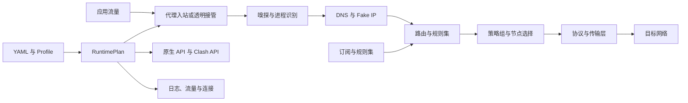

<p align="center">
  
</p>

<h1 align="center">WutherCore</h1>

<p align="center">
  面向桌面、服务器、路由器和 Android 的 Rust 代理内核
</p>

<p align="center">
  <a href="https://github.com/MiChongs/WutherCore/actions/workflows/ci.yml"></a>
  <a href="https://github.com/MiChongs/WutherCore/releases"></a>
  <a href="https://t.me/wuther_core_chat"></a>
  <a href="https://www.rust-lang.org/"></a>
  <a href="LICENSE"></a>
</p>

<p align="center">
  <a href="#快速开始">快速开始</a> ·
  <a href="#协议支持">协议支持</a> ·
  <a href="#流量接管">流量接管</a> ·
  <a href="docs/CONFIGURATION.md">配置指南</a> ·
  <a href="docs/API.md">管理 API</a> ·
  <a href="docs/ARCHITECTURE.md">架构</a>
</p>

WutherCore 负责节点接入、订阅更新、DNS、规则分流、透明代理、策略选择和运行状态管理。项目提供可执行内核与可复用的 Rust workspace，不包含桌面、Web 或移动端 GUI。

当前版本仍处于 1.0 之前。配置格式、协议字段和嵌入式 API 仍可能调整，生产部署前应使用目标平台和实际服务端完成互操作验证。

## 当前能力

### 配置与运行

* 使用 YAML 描述监听器、节点、订阅、策略组、DNS、规则和流量接管。
* `check` 在启动前检查字段、凭据、协议组合和平台约束。
* `explain` 输出补全 Profile 默认值后的 `RuntimePlan`。
* 支持 Desktop、Router、Android 等 Profile，也允许逐项覆盖。
* 启动失败会回滚已经创建的监听器、路由、防火墙规则和后台任务。

### 节点与策略

* 支持本地节点、订阅 URI、Clash/Mihomo 节点和迁移后的配置。
* 订阅具备拉取、缓存、过滤、重命名、去重和运行时刷新能力。
* 策略组支持手动选择、负载均衡、URLTest 和 Smart 学习选择。
* 节点评分、测速历史、手动选择和 Pin 状态可以持久化。

### 路由与进程识别

* 规则可匹配域名、域名后缀、IP、CIDR、源端口、目标端口、网络类型、进程名、进程路径、入站来源和规则集。
* Linux、Windows、macOS 和 Android 均有进程识别实现。
* Android root 模式可通过 Binder 查询 UID 对应的包名。
* `find-process-mode` 支持关闭、按需查询和始终查询。
* 路由规则、规则集和策略组可以在运行时刷新。

### DNS

* 支持 UDP、TCP、DoT、DoH 和 DoQ 上游。
* 支持命名上游、命名出口、嵌套服务组和独立的出口调度。
* 可选策略包括顺序、轮询、随机、并发首胜、并发合并和基于历史 RTT 的自适应选择。
* 支持缓存、Hosts、Fallback、IPv6 策略、Fake IP 和独立 UDP/TCP DNS 监听。
* 普通模式会保留 TXT、MX、SRV、CAA、DNSSEC、SVCB/HTTPS、ANY 和未知 QTYPE。

### 规则集

* 支持 Mihomo YAML、文本规则、MRS v1、sing-box JSON、SRS v1 至 v5、内联 Payload 和 WutherCore RRS。
* 二进制输入会经过有界解压、结构校验和统一 matcher 编译。
* 规则集支持运行时热更新、版本化 IP 前缀快照和变更通知。
* `ruleset convert` 可在常用文本、YAML、JSON 和 RRS 格式之间转换。

### 管理与观测

* 提供原生 `/v1` HTTP API 和 Clash/Mihomo 兼容 API。
* 支持节点、策略组、规则、规则提供者、DNS、连接、流量、日志、版本和运行能力查询。
* WebSocket 和普通 HTTP 接口均可用于连接与流量面板。
* 管理端支持密钥认证、CORS 限制、连接上限和非本机监听安全检查。

## 协议支持

### 入站

* Mixed HTTP 与 SOCKS5 共端口监听，支持 HTTP CONNECT、普通 HTTP 代理、SOCKS5 CONNECT 和 UDP ASSOCIATE。
* Shadowsocks 与 Shadowsocks 2022 TCP/UDP 服务端，支持 SIP003 插件、SIP022 EIH 和多用户配置。
* VLESS 入站与认证处理。
* gRPC 服务端传输。
* REALITY 服务端接入。
* XHTTP 与 SplitHTTP 服务端，覆盖 HTTP/1.1、HTTP/2 和 HTTP/3。
* WireGuard 正式入站，认证后的 IPv4/IPv6、TCP 和 UDP 会进入 Runtime 路由。
* Young 正式入站，使用 Mozilla Neqo、HTTP/3 和 WebTransport。
* TUN、TPROXY、REDIRECT 与 Android VpnService 流量入口。

### 出站

* 内置动作：Direct、Block、DNS Hijack。
* 通用代理：HTTP、SOCKS5。
* Shadowsocks 系列：Shadowsocks、Shadowsocks 2022、SSR、Snell。
* TLS 与 UUID 协议：Trojan、VLESS、VMess、AnyTLS。
* QUIC 与现代隧道：Hysteria、Hysteria 2、TUIC、Young。
* 专用协议：Mieru、Sudoku、TrustTunnel。
* 系统与远程隧道：WireGuard、SSH。
* 可选 Naive 出站，支持 Cronet H2/H3、UoT v2、ECH 和填充。

协议名称出现在列表中表示仓库内存在可执行实现和测试路径。UDP、复用、传输层和服务端版本仍需按照具体协议配置验证。

AnyTLS 已按官方协议 v2 实现认证、动态 padding scheme、会话复用、SYNACK 与 UDP-over-TCP v2，配置和线格式说明见 [AnyTLS 指南](docs/ANYTLS.md)。

Hysteria 1/2 已按官方线协议实现认证、TCP、UDP session/分片、XPlus、
Salamander/Gecko、端口跳跃与两代 Brutal；字段语义和配置约束见
[Hysteria 1 / 2 指南](docs/HYSTERIA.md)。

### Young

Young 是 WutherCore 的原生代理协议，客户端和服务端都使用 Mozilla Neqo 与 NSS：

```text
UDP
└── QUIC v1 与 TLS 1.3
    └── HTTP/3
        └── WebTransport
            ├── 双向流承载 TCP
            └── Datagram 承载 UDP
```

Young 支持会话复用、TCP 半关闭、UDP 分片与乱序重组、重放防护、证书固定、密钥轮换和协商后的双向数据填充。完整线协议、构建依赖和部署配置见 [Young 协议](docs/YOUNG_PROTOCOL.md)。

### WireGuard

WireGuard 客户端使用标准 NoiseIK 和用户态双栈网络栈，不会为每个节点创建系统网卡。实现包含：

* TCP、UDP、IPv4 和 IPv6。
* 多 Peer 最长前缀路由。
* 预共享密钥、持久保活和保留字节。
* 远端 DNS、端点漫游和重放防护。
* IPv4 与 IPv6 MTU 分片、重组和有界队列。
* 客户端、服务端和正式入站监听。

配置字段和多 Peer 示例见 [WireGuard 配置](docs/WIREGUARD.md)。

### Shadowsocks

Shadowsocks 实现覆盖客户端和服务端：

* Shadowsocks AEAD 与 Shadowsocks 2022。
* TCP、UDP、UDP over TCP 和 UDP 多目标关联。
* SIP003 插件管理。
* SIP022 EIH 多用户。
* 服务端 TCP/UDP 双栈监听。

详细说明见 [Shadowsocks 配置](docs/SHADOWSOCKS.md)。

## 传输与伪装

通用传输层包含 TCP、TLS、REALITY、WebSocket、HTTP 混淆、HTTP/2、gRPC、XHTTP、SplitHTTP、uTLS 和 ECH。协议注册阶段会检查不能执行的组合，不会把未知字段或未实现字段静默降级。

XHTTP 客户端与服务端支持：

* HTTP/1.1、HTTP/2 和 HTTP/3。
* `stream-one`、`stream-up` 和 `packet-up`。
* 独立下载端点和 XMUX。
* TLS、REALITY、uTLS、证书固定、OCSP Stapling 和 ECH。
* 静态证书、证书热更新、客户端证书验证和按 SNI 动态签发。

完整字段见 [XHTTP 与 SplitHTTP](docs/XHTTP.md)。

FinalMask 可组合到支持的传输路径中。TCP 侧包含 `header-custom`、`fragment`、`sudoku` 和 `xmc`；UDP 侧包含 `header-custom`、`mkcp-legacy`、`noise`、`salamander`、`sudoku`、`xdns`、`xicmp` 和 `realm`。配置会校验顺序、互斥项、密钥、长度范围和承载能力。

Naive 依赖 GPL-3.0-or-later 的 Cronet 组件，默认 MIT 构建和默认 Release 不启用。构建方式见 [Naive 出站](docs/NAIVE.md)。

## 流量接管

### 通用数据面

* 支持 IPv4 与 IPv6、TCP、UDP 和 ICMP 处理。
* TUN UDP 可启用 Endpoint Independent NAT，同一内部端点可复用稳定的外部关联访问多个目标。
* UDP 会话具备空闲回收、容量限制、反向流映射和多目标语义。
* 支持批量收发、TCP/UDP GRO 合并和 GSO 切分。
* 支持校验和处理、分片、重组、MTU 控制和数据包边界校验。
* 出站套接字统一执行回环保护、接口绑定、Linux `SO_MARK` 和 Android `VpnService.protect`。
* 自动路由、防火墙和策略路由变更带有资源声明、冲突检测、失败回滚和异常退出恢复。

推荐配置：

```yaml
capture:
  on: true
  method: auto
  stack: mixed
  mtu: 1500
  offload: true
  tun:
    auto-route: true
    strict-route: true
    endpoint-independent-nat: true
    udp-timeout: 5m
```

TUN MTU 必须在 `576..=65535`，启用 IPv6 时不得低于 `1280`。配置值会直接
应用到 Linux、Windows、macOS 和 Android 的实际设备，并约束用户态写包；
超长 IPv4/IPv6 包会按协议分片，DF 包会明确报错。`0`、截断值以及在
TPROXY/REDIRECT 模式中填写 MTU 都不会被静默接受。

### Linux

* 支持 TUN、TPROXY 和 REDIRECT。
* 支持 nftables 与 iptables 环境、fwmark 策略路由、自动选择默认路由表和物理接口绕行。
* TPROXY 覆盖 TCP、UDP、IPv4 和 IPv6。
* REDIRECT 使用受约束的 TCP NAT 路径，UDP 可由 TUN 数据面处理。
* 启动前会检查权限、内核能力、规则冲突和残留状态。

Linux 自动接管细节见 [Linux TUN auto_redirect](docs/LINUX-TUN-AUTO-REDIRECT.md)。

### Windows

* 使用 Wintun 接收和写回三层数据包。
* 管理 IPv4/IPv6 路由、接口 metric 和默认物理网卡选择。
* 出站套接字通过 `IP_UNICAST_IF` 与 `IPV6_UNICAST_IF` 避免再次进入 TUN。
* 支持进程路径和进程名识别，用于路由和连接面板。

### Android

* 非 root 模式通过宿主应用提供 VpnService 文件描述符。
* JNI 接口可导出 VpnService.Builder 所需的地址、路由、DNS 和应用过滤配置。
* 所有出站套接字可调用真实的 `VpnService.protect(fd)`。
* root 模式支持 `/dev/net/tun`、nftables、iptables、TPROXY 和 REDIRECT 能力分级。
* 支持 UID/GID 查询和 Binder 包名解析。
* 物理网络变化可以通过 JNI 通知内核刷新默认接口和绕行绑定。

### macOS

* 使用系统 TUN 与路由能力。
* 出站套接字按接口索引绑定，避免默认路由切换后发生自循环。
* 支持进程路径和进程名识别。

透明代理需要管理员、root 或宿主 VPN 权限。首次部署应先关闭 `capture` 验证普通 HTTP/SOCKS5 和 DNS，再启用系统接管。排错步骤见 [排错手册](docs/TROUBLESHOOTING.md)。

## 快速开始

需要 Rust 1.88 或更高版本。`rust-toolchain.toml` 默认使用 stable 工具链。

```bash
git clone https://github.com/MiChongs/WutherCore.git
cd WutherCore
cargo build --release -p wuther-core
```

复制桌面示例：

```bash
cp examples/desktop.yaml config.yaml
```

Windows PowerShell：

```powershell
Copy-Item examples\desktop.yaml config.yaml
```

检查配置并启动：

```bash
./target/release/wuther-core check config.yaml
./target/release/wuther-core explain config.yaml
./target/release/wuther-core run -c config.yaml
```

Windows 可执行文件位于 `target\release\wuther-core.exe`。

### 最小配置

```yaml
version: 1
profile: desktop
name: my-profile

listen:
  local: 7890
  panel: 127.0.0.1:9090
  share: false

feeds:
  airport: "https://example.com/subscription"

groups:
  main:
    choose: smart
    use: [airport]

route:
  preset: cn_smart
  final: main

resolver:
  mode: smart
```

可以直接修改这些示例：

* [`examples/desktop.yaml`](examples/desktop.yaml) 用于桌面普通代理。
* [`examples/router.yaml`](examples/router.yaml) 用于路由器和透明代理。
* [`examples/android.yaml`](examples/android.yaml) 用于 Android VpnService。
* [`examples/dns-advanced.yaml`](examples/dns-advanced.yaml) 展示分层 DNS 与命名出口。
* [`examples/with_feed.yaml`](examples/with_feed.yaml) 展示订阅过滤和重命名。
* [`examples/manual_only.yaml`](examples/manual_only.yaml) 只使用手动节点。
* [`examples/daily.yaml`](examples/daily.yaml) 展示自定义策略组和路由。

## 连接处理路径


```mermaid
flowchart LR
    Client["应用流量"] --> Inbound["代理入站或透明接管"]
    Inbound --> Inspect["嗅探与进程识别"]
    Inspect --> Resolver["DNS 与 Fake IP"]
    Resolver --> Route["路由与规则集"]
    Route --> Select["策略组与节点选择"]
    Select --> Protocol["协议与传输层"]
    Protocol --> Network["目标网络"]

    Config["YAML 与 Profile"] --> Runtime["RuntimePlan"]
    Runtime --> Inbound
    Providers["订阅与规则集"] --> Route
    Runtime --> API["原生 API 与 Clash API"]
    Runtime --> Observe["日志、流量与连接"]
```

模块边界和启动过程见 [架构说明](docs/ARCHITECTURE.md)。

## 命令行

```text
wuther-core run -c <file>                       启动内核
wuther-core check <file>                        校验配置
wuther-core explain <file>                      输出 RuntimePlan
wuther-core migrate mihomo <input> -o <output> 迁移 Mihomo 配置
wuther-core feeds list <file>                   列出订阅
wuther-core feeds refresh <file>                刷新订阅
wuther-core ruleset list <file>                 列出外部规则集
wuther-core ruleset refresh <file>              刷新外部规则集
wuther-core ruleset convert <in> <out>          转换规则集
wuther-core store info                          查看持久化存储
wuther-core store reset                         清空学习数据
```

每个命令都支持 `--help`。

## 下载与构建

预编译产物在 [GitHub Releases](https://github.com/MiChongs/WutherCore/releases) 发布，覆盖 Linux、Android、Windows 和 macOS 的主要架构。正式版和预发布版都包含 `SHA256SUMS` 与 GitHub 构建证明。

```bash
sha256sum -c SHA256SUMS
gh attestation verify <archive.zip> --repo MiChongs/WutherCore
```

Young 构建需要 Mozilla NSS 原生库。Naive 构建需要 `with_naive` feature、Cronet 动态库和相应许可处理。协议与传输组件可以通过 `with_*` 编译标签精确裁剪，本地构建和 GitHub CI 使用同一套标签。完整标签表及各平台构建方式见 [构建脚本](scripts/README.md) 和 [发版指南](docs/RELEASING.md)。

## 文档

* [文档中心](docs/README.md)
* [功能矩阵](docs/FEATURES.md)
* [配置指南](docs/CONFIGURATION.md)
* [架构说明](docs/ARCHITECTURE.md)
* [管理 API](docs/API.md)
* [Young 协议](docs/YOUNG_PROTOCOL.md)
* [XHTTP 与 SplitHTTP](docs/XHTTP.md)
* [WireGuard 配置](docs/WIREGUARD.md)
* [Shadowsocks 配置](docs/SHADOWSOCKS.md)
* [Naive 出站](docs/NAIVE.md)
* [Linux TUN auto_redirect](docs/LINUX-TUN-AUTO-REDIRECT.md)
* [排错手册](docs/TROUBLESHOOTING.md)
* [路线图](ROADMAP.md)

## 开发与协作

```bash
cargo fmt --all --check
cargo check --workspace --all-targets
cargo test --workspace --all-targets
cargo doc --workspace --no-deps
python scripts/check-repository.py
```

提交代码前请阅读 [CONTRIBUTING.md](CONTRIBUTING.md)。Bug 与功能建议使用 [Issue 表单](https://github.com/MiChongs/WutherCore/issues/new/choose)，配置讨论和一般问题放在 [Discussions](https://github.com/MiChongs/WutherCore/discussions)。

安全问题不要公开提交 Issue，请按照 [SECURITY.md](SECURITY.md) 私下报告。维护方式、合并门禁和管理员紧急合并路径见 [GOVERNANCE.md](GOVERNANCE.md)。

## License

除 `third_party/xray-transport` 外，项目使用 [MIT License](LICENSE)。`third_party/xray-transport` 使用 [MPL License](third_party/xray-transport/LICENSE-MPL-2.0)。
